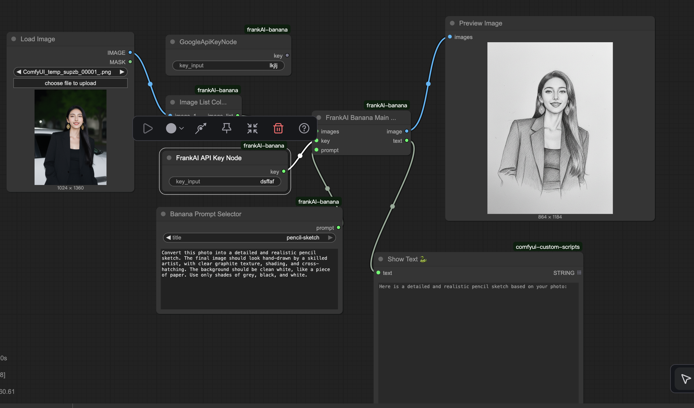
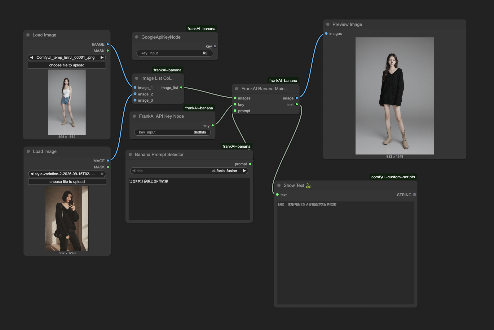

# ComfyUI-frankAI-banana

A set of ComfyUI nodes for calling the Nano-Banana API , while also supporting the Google API and frankAI API. 

一組調用Nano-Banana API的ComfyUI節點，同時支持Google API 和 frankAI API. 

## Install 安装

```bash
cd comfyUI/custom_nodes
git clone https://github.com/fr0nky0ng/ComfyUI-frankAI-banana.git
```

## Manual 说明

Users can use their own Google API Key. Please use the "Google API Key Input" node to input your key.

If you are using the API Key provided by frankAI, use the "FrankAI API Key Input" node to input your key.

用户可以使用自己的Google API Key, 请使用"Google API Key Input"节点输入你的“key"。

如果使用frankAI提供的API Key, 则使用"FrankAI API Key Input"节点输入你的“key"。

Currently only supports image generation, so there must be at least one image on the input side

目前只支持图生图，所以输入端至少要有一张图



Support up to 3 pictures

最多支持输入3张图片


